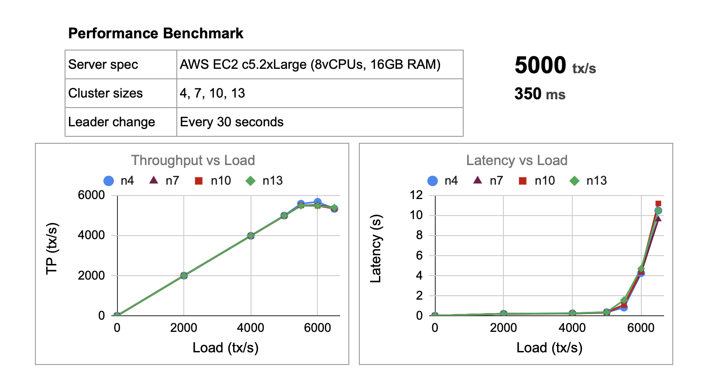

# Juria Blockchain
[Juria](https://aungmawjj.github.io/juria-blockchain) is a high-performance consortium blockchain with [Hotstuff](https://arxiv.org/abs/1803.05069) consensus mechanism and a transaction-based state machine.

Hotstuff provides a mechanism to rotate leader (block maker) efficiently among the validator nodes. Hence it is not required to have a single trusted leader in the network.

With the use of Hotstuff three-chain commit rule, Juria blockchain ensures that the same history of blocks is committed on all nodes despite network and machine failures.



## Getting started
You can run the cluster tests on local machine in a few seconds.

1. Install dependencies
```bash
# MacOS
xcode-select --install
```
```bash
# Ubuntu
sudo apt-get install build-essential
```
2. Download and install [`go 1.16`](https://golang.org/doc/install)
3. Prepare the repo
```bash
git clone https://github.com/aungmawjj/juria-blockchain
cd juria-blockchain
go mod tidy
```
4. Run tests
```bash
cd tests
go run .
```

The test script will compile `cmd/juria` and set up a cluster of 4 nodes with different ports on the local machine.
Experiments from `tests/experiments` will be run and health checks will be performed throughout the tests.

***NOTE**: Network simulation experiments are only run on the remote linux cluster.*

## Documentation
* [Key Concepts](https://aungmawjj.github.io/juria-blockchain/key-concepts)
* [Cluster Tests](https://aungmawjj.github.io/juria-blockchain/cluster-tests)
* [Benchmark](https://aungmawjj.github.io/juria-blockchain/benchmark)
<!-- * [Setup Cluster](https://aungmawjj.github.io/juria-blockchain/setup-cluster) -->

## About the project
### License
This project is licensed under the GPL-3.0 License.

### Contributing
When contributing to this repository, please first discuss the change you wish to make via issue, email, or any other method with the owners of this repository before making a change.
